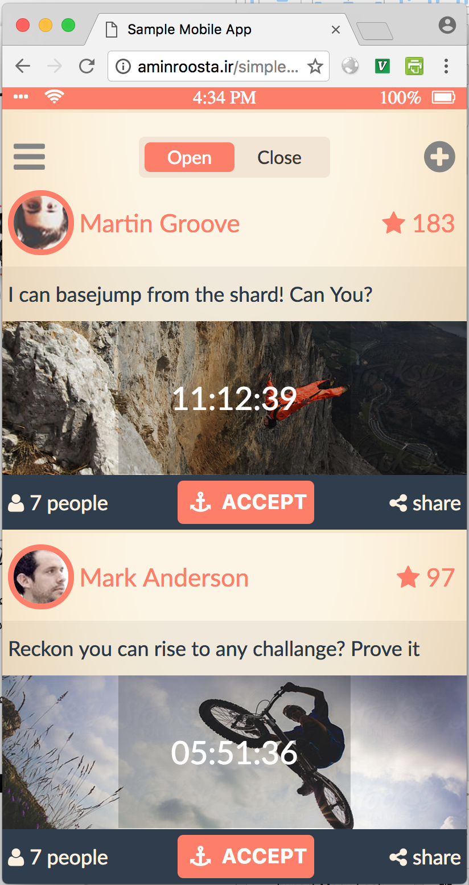
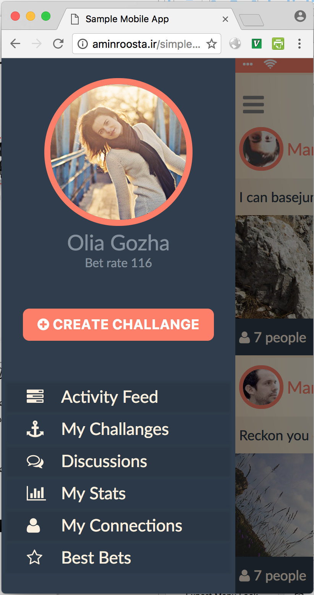

Simple Mobile App
=====================
Build using react :-)

### Usage

```
// to build the development version
npm install
npm start
open http://localhost:3000

// to build the production version
npm install -g webpack // make sure webpack is installed globally
npm run build
```

# Screens





### Demo
You can see a live version [ghtihub gh-pages](http://aminroosta.ir/simplemobileapp/).  
This is only optimized for mobile browsers (no fallback for desktop right now).

